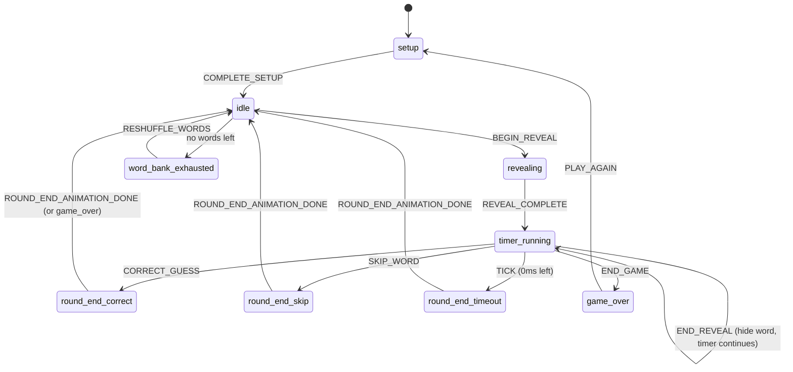

# Architecture — State Machine



## Key files

| File | Role |
|------|------|
| `src/types/game.ts` | All TypeScript types + copy constants |
| `src/lib/game-state-machine.ts` | `gameReducer()` — single source of truth |
| `src/lib/word-engine.ts` | Filter pool, pick random, no-repeat |
| `src/lib/use-game-loop.ts` | 200ms timer tick, 1.2s reveal hold, round-end delays |
| `src/store/game-store.ts` | Zustand store wrapping reducer |

## Adding a feature

1. Add action type to `GameAction` in `types/game.ts`
2. Handle in `gameReducer()` 
3. Dispatch from component
4. Render new `phase` in UI if needed

## Word bank

Regenerate after editing `scripts/generate-words.mjs`:

```bash
npm run generate-words
```

JSON schema per word:

```json
{
  "id": "w001",
  "text": "cat",
  "category": "animals",
  "difficulty": "easy",
  "drawable": 3,
  "tags": ["phrase"]
}
```
